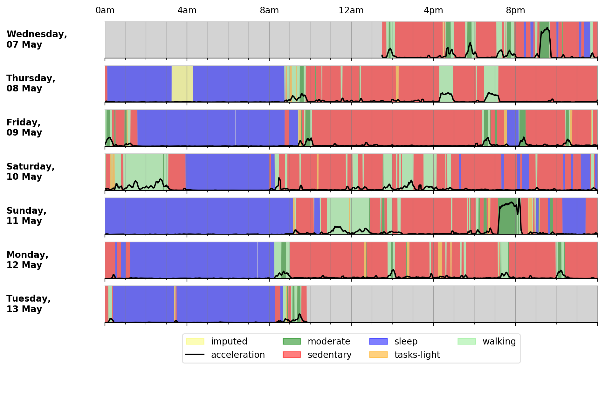

# radarad-device-axivity

This project presents a test environment for the parser developed by [Biobank Accelerometer Analysis](https://github.com/activityMonitoring/biobankAccelerometerAnalysis). The test environment consists of a Dockerified ubuntu OS with a JDK installed. The source code of Biobank Accelerometer Analysis is mounted under the directory **workdir**. To have the test environment please follow the commands below.

## Clone this github project

```bash
git clone https://github.com/halilagin/radarad-device-axivity.git
```

## Change directory in the project
```bash
cd radarad-device-axivity
```

## Change directory in **workdir** directory
```bash
cd workdir
```

## Download the Biobank Accelerometer Analysis project.
```bash
git clone https://github.com/activityMonitoring/biobankAccelerometerAnalysis.git
```

## Delete the .git of the Biobank Accelerometer Analysis project.

```bash
rm -rf biobankAccelerometerAnalysis/.git
```

## Introduce a JDK to the docker container.

To introduce a JDK to docker container, you need to download a JDK and and update the mount path of the JDK in docker-compoe.yml file. First, go to the root directory of this project and follow the commands below.

### Downlaod JDK
```bash
sh download.java.sh
```
### UnTar JDK
Use tar command to untar the downloaded file.


### Create a directory named "containers-programs". 
The downloaded JDK should be in the directory "containers-programs". Normally you will have that file in the project repository  as a symbolic link. Remove that symbolic link file and create a directory with the same name.


```bash
rm containers-programs #remove the symbolic link
mkdir containers-programs
```

### Move untarred JDK into containers-programs with the directory name **jdk**

The final home directory of the JDK should have the name **jdk** because it is introduced in docker-compose.yml with that name.

```bash
mv  {UNTARRED JDK DIRECTORY} containers-programs/jdk
```


## Run Docker instance

```bash
sh dcup.sh
```
## Connect to  the docker instance via terminal


```bash
sh dcterminal.sh
```


## In docker environment, test the code as introduced in the project Biobank Accelerometer Analysis
This commands are taken from the project  [Biobank Accelerometer Analysis](https://github.com/activityMonitoring/biobankAccelerometerAnalysis). Please see their home page for further information.

Follow the commands below.

```bash
cd workdir/biobankAccelerometerAnalysis
sh utilities/downloadDataModels.sh
javac -cp java/JTransforms-3.1-with-dependencies.jar java/*.java
python3 accProcess.py data/sample.cwa.gz
python3 accPlot.py data/sample-timeSeries.csv.gz data/sample-plot.png
```

## Validatation

If you see the file data/sample-plot.png under biobankAccelerometerAnalysis project folder which is similar to the one below it means that everything is working as expected.



